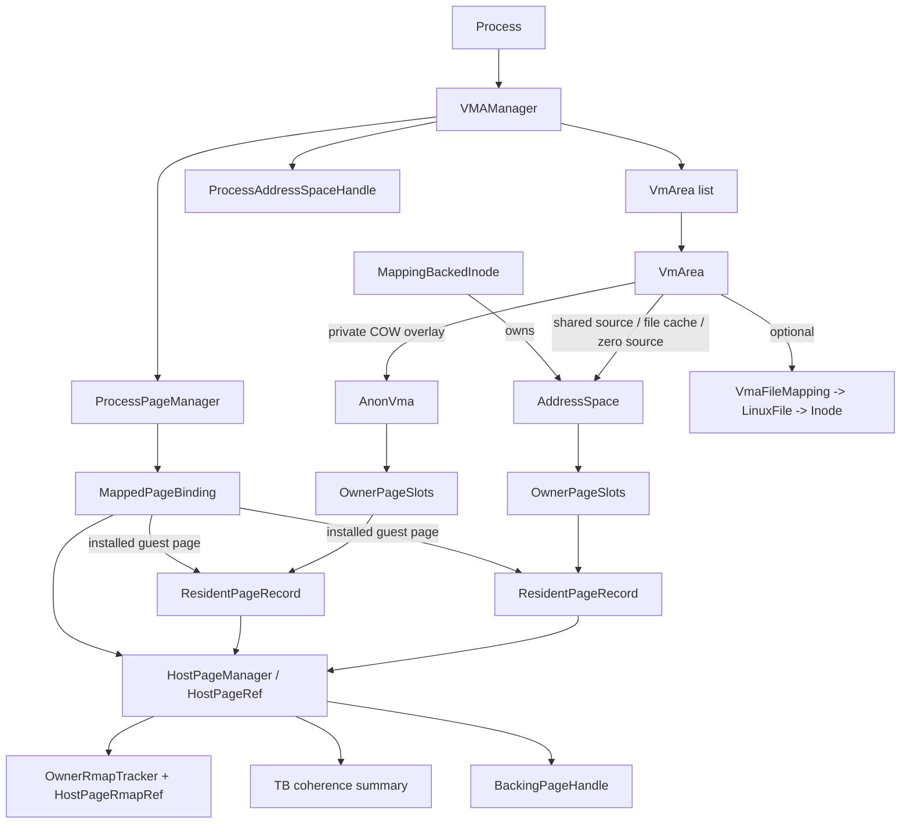
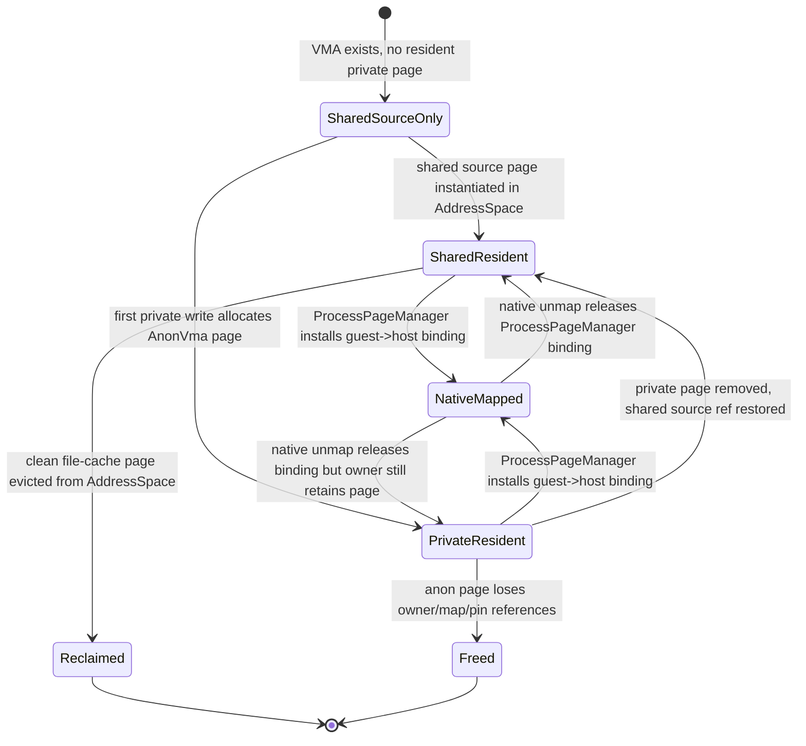

# Memory Management Deep Dive

This document describes the current Fiberish memory-management implementation as it exists in code today.
It focuses on the real object graph and runtime behavior in:

- `Fiberish.Core/Memory/VMAManager.cs`
- `Fiberish.Core/Memory/VmArea.cs`
- `Fiberish.Core/Memory/LinuxMemoryObjects.cs`
- `Fiberish.Core/Memory/OwnerPageSlots.cs`
- `Fiberish.Core/Memory/HostPageRef.cs`
- `Fiberish.Core/Memory/ProcessPageManager.cs`
- `Fiberish.Core/Memory/BackingPageHandle.cs`
- `Fiberish.Core/VFS/Structs.cs`

For forward-looking host-page redesign notes, see [HostPage Linux-Style Redesign](./hostpage-linux-style-design.md) and [HostPage Slot Ownership Design](./hostpage-slot-ownership-design.md). This document is about the current implementation, not those proposals.

## Table of Contents

1. High-Level Model
2. Core Objects and Relationships
3. The Actual Ownership Model
4. Host Page Metadata and Reverse Mapping
5. Fault Path and Mapping Installation
6. Lifecycle
7. `fork`, `mprotect`, `munmap`, truncate, and inode invalidation
8. Writeback, reclaim, shared memory, and zero pages
9. Corrections vs older design descriptions
10. Ownership Summary

## 1. High-Level Model

The current design is best understood as a split between four layers:

1. `VMAManager` manages one process-visible guest address space.
2. `VmArea` describes virtual ranges inside that address space.
3. `AddressSpace` and `AnonVma` own resident managed pages.
4. `ProcessPageManager` mirrors which guest pages are currently installed into the native MMU.

A useful rule of thumb is:

- managed objects (`VmArea`, `AddressSpace`, `AnonVma`, `HostPageManager`) define semantics and lifetime;
- native MMU state is a cache of installed guest->host mappings;
- `ProcessPageManager` is the managed mirror of that installed cache.

This means a native mapping can be torn down and later rebuilt from managed state without losing guest-visible memory contents, as long as the underlying managed owner still retains the page.

## 2. Core Objects and Relationships

### 2.1 Object relationship graph

### 2.2 `VMAManager`

`VMAManager` is the authoritative managed address-space object for a process. It owns:

- the sorted `_vmas` list;
- `PageMapping : ProcessPageManager`;
- address-space synchronization state (`_mapSequence`, `_pendingCodeCacheResets`);
- TB-coherence write-protect tracking (`_tbWpPages`);
- mapped-inode reference counts used to register/unregister with inodes;
- `AddressSpaceHandle`, which represents the MMU identity used for TB coherence and engine attachment.

Its main jobs are:

- create/split/remove `VmArea`s;
- resolve faults;
- install or tear down native mappings;
- capture dirty state back into managed owners when needed;
- publish invalidation sequence changes to peer engines through `ProcessAddressSpaceSync`.

### 2.3 `VmArea`

`VmArea` is the per-range metadata object. Important fields are:

- `Start`, `End`
- `Perms`, `Flags`
- `FileMapping`, `File`
- `Offset`, `VmPgoff`
- `VmMapping : AddressSpace?`
- `VmAnonVma : AnonVma?`

Current interpretation:

- `VmMapping` is the shared backing view for the VMA.
- `VmAnonVma` is the private overlay for `MAP_PRIVATE` pages that have been materialized.
- even anonymous private mappings usually still have a non-null `VmMapping`: they use the runtime's shared zero `AddressSpace`.
- shared anonymous mappings are represented as shmem-backed `AddressSpace`, created through an internal tmpfs file.
- file-private mappings use both:
  - `VmMapping` as the clean/shared source;
  - `VmAnonVma` as the private COW destination once pages are written.

`VmArea` also provides the canonical page-index and offset helpers used throughout the implementation:

- `GetPageIndex(...)`
- `GetRelativeOffsetForPageIndex(...)`
- `GetGuestPageStart(...)`
- `GetAbsoluteFileOffsetForPageIndex(...)`
- `GetFileBackingLength()`

### 2.4 `AddressSpace`

`AddressSpace` is the managed owner for file-backed, shmem-backed, and zero-backed shared source pages.

Current `AddressSpaceKind` values are:

- `File`
- `Shmem`
- `Zero`

Each `AddressSpace` contains:

- `OwnerPageSlots Pages`
- rmap attachment state (`_rmapAttachments`)
- owner-root rmap storage (`_ownerRmap`)
- reference counting (`AddRef` / `Release`)

Important behavior:

- file-backed mappings use the inode's `MappingBackedInode.Mapping` object;
- shmem uses the same `AddressSpace` machinery but is tracked as `Shmem` in `AddressSpacePolicy`;
- zero-fill anonymous private read faults are backed by a special `ZeroInode` whose mapping kind is `Zero`.

### 2.5 `AnonVma`

`AnonVma` owns private resident pages for `MAP_PRIVATE` mappings.

It contains:

- `OwnerPageSlots Pages`
- `Parent`
- `Root`
- rmap attachment state for the concrete `AnonVma`
- owner-root rmap storage anchored on `Root`

Two details matter in the current implementation:

1. `VmAnonVma` is created lazily on first private write fault.
2. `CloneForFork()` creates a new `AnonVma(parent: this)`, but the clone shares the same `Root` as the original root. That lets fork-related descendants share one owner-root namespace for reverse mapping, while each concrete `AnonVma` still carries its own resident-page table and VMA attachments.

### 2.6 `ProcessPageManager`

`ProcessPageManager` is the current installed-mapping table for one `VMAManager`.
It is not the owner of page contents.

It stores:

- `guest page start -> MappedPageBinding`

Each `MappedPageBinding` describes:

- `Ptr`
- `OwnerKind` (`AddressSpace` or `AnonVma`)
- owner object reference (`Mapping` or `AnonVma`)
- `ResidentPageRecord? Page`
- `PageIndex`

Important current behavior:

- adding a binding increments `HostPage.MapCount`;
- releasing a binding decrements `HostPage.MapCount`;
- for anon bindings, release may immediately remove the `AnonVma` page if it is no longer mapped, pinned, or multiply owned.

### 2.7 `BackingPageHandle`

`BackingPageHandle` is the ownership token for externally backed host memory.
It is a value type that remembers:

- `Pointer`
- a release owner implementing `IBackingPageHandleReleaseOwner`
- a release token

Current release owners are:

- `BackingPagePool` for pool-backed/anonymous pages;
- `Inode` for host-mapped file windows and similar inode-owned mapped handles.

`BackingPageHandle` does not describe virtual mapping state. It exists purely so host memory can be released correctly when the final managed owner disappears.

## 3. The Actual Ownership Model

### 3.1 Guest-range ownership vs page ownership

Ownership is intentionally split:

- `VMAManager` owns address-space metadata.
- `VmArea` owns the range-level view.
- `AddressSpace` or `AnonVma` owns the resident page slot.
- `HostPageManager` owns host-page metadata records.
- `BackingPageHandle` owns the release path for the underlying host allocation or mapped window.
- `ProcessPageManager` owns only the fact that a host page is currently installed into the native MMU for a guest page.

### 3.2 `OwnerPageSlots` is the real resident-page container

Older descriptions used `VmPageSlots` / `VmPage`, but the current implementation uses:

- `OwnerPageSlots`
- `ResidentPageRecord`

`OwnerPageSlots` stores `Dictionary<uint, ResidentPageRecord>` and is responsible for:

- insertion/replacement of owner pages;
- allocating pages on demand for owners;
- binding and unbinding `HostPage` owner roots;
- truncation and removal;
- eviction of clean file-cache pages;
- notifying rmap attachment code when a page binding changes.

`ResidentPageRecord` is a thin wrapper over `HostPageRef` and exposes page state through the shared host-page metadata:

- `Dirty`
- `Uptodate`
- `Writeback`
- `MapCount`
- `PinCount`
- `LastAccessTimestamp`

### 3.3 Host page metadata is global per pointer

`HostPageManager` keeps one metadata record per live host page pointer.
Each record tracks:

- `Kind` (`PageCache`, `Anon`, `Zero`)
- dirty/uptodate/writeback bits
- `MapCount`
- `PinCount`
- `OwnerResidentCount`
- owner-root binding (`AddressSpace` or `AnonVma.Root`, plus page index)
- optional `BackingPageHandle`
- TB-coherence summary

This means the real lifecycle decision is based on the host page, not on any single VMA.

## 4. Host Page Metadata and Reverse Mapping

### 4.1 What “rmap” means here

The current rmap system answers the question:

- given a host page pointer, which `(VMAManager, VmArea, guest page)` currently refer to it?

That information is needed for:

- TB coherence / W^X policy changes;
- code-cache invalidation after writes;
- debugging and reverse-holder lookup.

### 4.2 Two layers of rmap bookkeeping

There are two distinct structures involved.

#### A. Attachment layer: which VMAs can contribute refs

Both `AddressSpace` and `AnonVma` maintain `_rmapAttachments`, each entry containing:

- `Mm : VMAManager`
- `Vma : VmArea`
- `StartPageIndex`
- `EndPageIndexExclusive`

`VMAManager` updates these attachments when a VMA is:

- inserted;
- split by `munmap` or `mprotect`;
- migrated to a new mapping;
- removed.

#### B. Owner-root layer: actual reverse refs for resident host pages

Actual reverse refs are stored in `OwnerRmapTracker` using this logical key:

- owner-local `pageIndex`
- `hostPagePtr`
- `HostPageRmapKey(MM, VMA, ownerKind, pageIndex)`

The value is `HostPageRmapRef`, which stores:

- `Mm`
- `Vma`
- `OwnerKind`
- `PageIndex`
- `GuestPageStart`

This storage lives:

- on `AddressSpace._ownerRmap` for page-cache / zero-backed pages;
- on `AnonVma.Root._ownerRmap` for anon-private pages.

### 4.3 How refs are added and removed

#### Shared mapping side (`AddressSpace`)

When a VMA attaches to an `AddressSpace`:

- `AddRmapAttachment(...)` records the attachment;
- all already-resident pages in the covered index range are scanned;
- `HostPages.AddOrUpdateRmapRef(...)` is called for each resident page.

When a resident page appears or disappears later:

- `OwnerPageSlots` invokes `OnPageBindingChanged(...)`;
- `AddressSpace` adds or removes the direct rmap ref for every attached VMA that covers that page index.

For private mappings, `AddressSpace.AddDirectRefLocked(...)` skips adding the shared ref if the same page index already has an overriding private page in `VmAnonVma`.

#### Private overlay side (`AnonVma`)

When a private page is installed:

- `AnonVma.OnPageBindingChanged(...)` removes the shared `AddressSpace` rmap ref for covered VMAs at that page index;
- then adds the anon direct ref.

When a private page disappears:

- the anon direct ref is removed;
- if there is no longer a private page for that slot, the shared mapping ref is restored from `VmMapping`.

That “remove shared ref on private install, restore it on private removal” behavior is the core of how the current implementation models `MAP_PRIVATE` overlay semantics in rmap.

### 4.4 `mprotect` and VMA split interaction

When `mprotect` splits a VMA, the code does not tear down and rebuild all resident pages from scratch.
Instead it updates reverse refs in place by using:

- `UpdateTbCohRolesForVmaRange(...)`
- `RebindRmapRefsForVmaRange(...)`
- `ResetVmAreaAttachmentsForSplit(...)`

So the host page retains the same owner/root, while the `(old VMA -> new VMA)` reverse references are rebound to the new range objects.

### 4.5 TB coherence on top of rmap

Each host page also carries `HostPageTbCohSummary`, which counts:

- writer refs;
- executable identities (`VMAManager.AddressSpaceIdentity`).

From that summary the page derives a writer policy:

- no writers;
- allow all writers;
- protect all writers;
- protect all except one executable identity.

`TbCoh` uses rmap to:

- discover executable peers of a host page;
- invalidate translated blocks in peer address spaces on write fault;
- maintain `_tbWpPages` in each `VMAManager` so writable mappings can be temporarily write-protected at the native MMU layer.

This is tightly coupled with rmap: without reverse refs, the runtime would not know which executable guest pages must be invalidated when a writable alias faults.

## 5. Fault Path and Mapping Installation

### 5.1 Shared-source resolution

Shared-source resolution is centralized in:

- `ResolveSharedBackingPage(...)`
- `ResolveAndMapSharedBackingPage(...)`
- `MapResolvedBackingPage(...)`

There are three main shared-source cases:

1. `AddressSpaceKind.Zero`
   - anonymous private mappings without a private page read from the shared zero mapping.
2. file-backed source
   - `MappingBackedInode.AcquireMappingPage(...)` supplies page-cache pages.
3. shared-anonymous source
   - shmem `AddressSpace.GetOrCreatePage(...)` allocates/populates pages directly.

### 5.2 Private fault resolution

Private faults are handled by `ResolvePrivateFault(...)`.

Current behavior is:

- read fault with existing private page:
  - map that `AnonVma` page read-only.
- read fault without private page:
  - map the shared source (`VmMapping`), which may be file-backed or zero-backed.
- write fault with existing private page:
  - if the host page has `OwnerResidentCount <= 1`, keep it and just make it writable;
  - otherwise allocate a replacement page and copy for COW replacement.
- first write fault without private page:
  - resolve the shared source page;
  - allocate an anon page;
  - copy source contents;
  - lazily create `VmAnonVma` if needed;
  - install the page into `AnonVma` and map it writable.

### 5.3 Native mapping install path

Actual native installation is funneled through `EnsureExternalMapping(...)`.

Important current semantics:

- if the same host pointer is already installed for that guest page, only permissions are refreshed with `engine.MemMap(...)`;
- if a different page is already installed, `ProcessPageManager.Release(...)` is called first;
- successful install adds a `MappedPageBinding` to `ProcessPageManager` and maps the host pointer into the MMU;
- `MapCount` changes are therefore tied to `ProcessPageManager`, not to `OwnerPageSlots`.

## 6. Lifecycle

### 6.1 Page lifecycle graph

### 6.2 Resident page lifetime

A resident page typically passes through these stages:

1. host memory is obtained
   - from `BackingPagePool`, or
   - from inode-provided mapped-page handles, or
   - from the shared zero page.
2. `HostPageManager` registers metadata for that pointer.
3. `OwnerPageSlots` binds the host page to an owner root (`AddressSpace` or `AnonVma.Root`).
4. reverse refs appear as VMAs attach and/or as pages become resident.
5. `ProcessPageManager` may map the page into one or more guest pages, incrementing `MapCount`.
6. later, owner residency, installed mappings, and pins each drop independently.
7. once all of these are gone, `HostPageManager.TryRemoveIfUnused(...)` removes the host-page metadata and releases the backing handle.

### 6.3 `BackingPageHandle` lifecycle

`BackingPageHandle` is attached when a host page comes from an external backing source.

Typical flow:

1. allocator or inode creates the handle;
2. `OwnerPageSlots` consumes the handle while registering the host page;
3. the live `HostPage` metadata stores the handle;
4. when the last owner/map/pin state disappears, `HostPageRef.TryRemoveIfUnused()` releases the handle;
5. the release callback returns memory to `BackingPagePool` or tells the inode/backend to release its mapped window.

### 6.4 Why `OwnerResidentCount` matters

`OwnerResidentCount` counts how many owner slots currently retain the page under the same owner root binding.
It is used for two important decisions:

- whether an existing private page can be reused in place on write fault (`OwnerResidentCount <= 1`);
- whether an anon page can be removed immediately when a native mapping disappears.

This is why `fork()` can share a private host page across parent/child descendants until a later write forces replacement.

## 7. `fork`, `mprotect`, `munmap`, truncate, and inode invalidation

### 7.1 `fork`

Current non-`CLONE_VM` fork behavior is:

1. parent captures dirty private pages with `CaptureDirtyPrivatePages(...)`;
2. native CPU/MMU is cloned with external mappings preserved;
3. managed `VMAManager` is cloned;
4. `VmArea.Clone()` clones file references and calls `VmAnonVma?.CloneForFork()`;
5. child `ProcessPageManager` is rebuilt from native installed mappings via `RebuildExternalMappingsFromNative(...)`;
6. parent and child private ranges are reprotected read-only to enforce later COW;
7. mappings are not torn down at fork time.

Important current details:

- the child gets its own cloned `AnonVma` objects, but those objects share the same `Root` lineage for owner-root rmap accounting;
- `CloneForFork()` installs the same host page pointers into the child anon owner table, so private pages are initially shared page-for-page;
- later writes decide whether the page can be reused in place or must be replaced, based on `OwnerResidentCount`.

### 7.2 `mprotect`

Current `mprotect` behavior:

- validates that the whole range is covered;
- splits/reuses `VmArea`s as needed;
- updates or rebinds rmap references for resident pages;
- adjusts TB-coherence roles;
- if resulting protection is not `Protection.None`, calls `ReprotectNativeMappings(...)`;
- if resulting protection is `Protection.None`, uses `TearDownNativeMappings(...)` to fully unmap the native pages.

So the current statement is:

- ordinary protection changes are reprotect-only;
- `prot == NONE` is a special case that behaves like tearing down installed mappings.

### 7.3 `munmap`

Current `munmap` behavior is:

1. find affected `VmArea`s;
2. for removed portions of shared file mappings, call `SyncVmArea(...)` first;
3. collect affected host pages for TB-coherence recomputation;
4. queue anon object-page release ranges if private overlays are being unmapped;
5. unregister VMA attachments and rewrite/split/remove `VmArea`s;
6. tear down native mappings with `TearDownNativeMappings(...)`;
7. if native teardown succeeded, actually release queued anon pages;
8. clear TB write-protect tracking and recompute W^X policy for affected host pages.

The `preserveOwnerBinding` path during teardown is important:

- `ProcessPageManager.ReleaseRange(..., preserveOwnerBinding: true)` temporarily keeps owner binding intact while the VMA surgery is finishing;
- after teardown completes, queued anon owner slots are removed explicitly.

That ordering prevents losing owner state too early during `munmap`.

### 7.4 truncate and inode invalidation

There are two related but distinct paths.

#### File truncate

`OnFileTruncate(...)`:

- computes the guest ranges that now lie beyond EOF;
- truncates both `AddressSpace` and `VmAnonVma` owner tables to the new size;
- publishes code-cache invalidation sequences;
- tears down affected native mappings in every participating engine of the target address space.

Notably, private file-backed COW pages are truncated in metadata too; they are not written back to the file.

#### Inode invalidation / unmap mapping range

`UnmapMappingRange(...)`:

- enumerates all `VMAManager`s registered on the inode;
- computes guest ranges overlapping the invalidated file interval;
- if `evenCows == false`, skips `MAP_PRIVATE` VMAs;
- if `evenCows == true`, also tears down private file mappings so later access re-faults against new file state.

This matches the intended Linux-style distinction between “invalidate shared mappings” and “invalidate even private COW views”.

## 8. Writeback, reclaim, shared memory, and zero pages

### 8.1 Shared file writeback

Only shared file mappings participate in writeback through:

- `CaptureDirtySharedPages(...)`
- `SyncVmArea(...)`
- `SyncMappedFile(...)`
- `SyncAllMappedSharedFiles(...)`

Current model:

- dirty state is first sampled from engines (`engine.IsDirty(page)`);
- dirtiness is copied into `AddressSpace` and inode dirty state;
- `MappingBackedInode.SyncCachedPages(...)` writes dirty cached pages back;
- host-mapped file pages may use `TryFlushMappedPage(...)` / `SyncMappedPage(...)` fast paths.

Private COW pages in `AnonVma` are not part of file writeback.

### 8.2 Reclaim policy

The current global cache policy object is `AddressSpacePolicy`, not `GlobalAddressSpaceCacheManager`.

It tracks `AddressSpace` instances by weak reference and page-count callback, with cache classes:

- `File`
- `Shmem`

Current reclaim behavior:

- only clean file-cache pages are reclaim candidates;
- shmem pages are tracked for accounting but skipped by reclaim;
- reclaim works by calling `AddressSpace.TryEvictCleanPage(...)` on least-recently-used clean file pages.

`AnonVma` pages are not tracked by `AddressSpacePolicy` and are never reclaimed through this path.

### 8.3 Shared anonymous memory and SysV SHM

Current behavior:

- `MAP_SHARED | MAP_ANONYMOUS` is implemented by creating an internal tmpfs/shmem file through `MemoryRuntimeContext.CreateSharedAnonymousMappingFile(...)`;
- SysV SHM also uses shmem/tmpfs-backed files and therefore normal `AddressSpace` machinery;
- both therefore behave like shared `AddressSpace`, not like private anonymous zero-source mappings.

### 8.4 Zero page

Anonymous private mappings do not use `VmMapping == null` as a zero source.
They use a real `AddressSpaceKind.Zero` mapping owned by `ZeroInode`.

That zero mapping:

- provides one shared zero-filled host page;
- is registered in `HostPageManager` as `HostPageKind.Zero`;
- participates in the same shared-source fault path as other `AddressSpace` owners, but does not behave like ordinary reclaimable page cache.

## 9. Corrections vs older design descriptions

The following statements are outdated and should not be used anymore:

### 9.1 `VmPageSlots` / `VmPage`

Outdated description:

- resident owner pages live in `VmPageSlots` as `VmPage` objects.

Current implementation:

- resident owner pages live in `OwnerPageSlots` as `ResidentPageRecord` entries backed by `HostPageRef`.

### 9.2 `ExternalPageManager`

Outdated description:

- the installed native-mapping mirror is `ExternalPageManager`.

Current implementation:

- the installed native-mapping mirror is `ProcessPageManager`.

### 9.3 anonymous private mappings start with `VmMapping == null`

Outdated description:

- anonymous private mappings have no shared managed backing until a private page is created.

Current implementation:

- anonymous private mappings use the shared zero `AddressSpace` from `ZeroInode` as their initial shared source;
- `VmAnonVma` is still created lazily on first private write.

### 9.4 `MappedPageBinding` supports raw/zero/special owner kinds

Outdated description:

- installed native bindings distinguish `RawPointer`, `ZeroPage`, or `Special` owner kinds.

Current implementation:

- `MappedPageBinding.OwnerKind` only has two values:
  - `AddressSpace`
  - `AnonVma`
- zero pages are represented as `AddressSpaceKind.Zero` / `HostPageKind.Zero`, not as a separate binding kind.

### 9.5 `GlobalAddressSpaceCacheManager`

Outdated description:

- global cache maintenance is handled by `GlobalAddressSpaceCacheManager`.

Current implementation:

- global address-space accounting and reclaim live in `AddressSpacePolicy` and `MemoryPressureCoordinator`.

### 9.6 `mprotect` never tears down mappings

This is only mostly true.

Current implementation:

- normal permission changes use reprotect;
- but `mprotect(..., Protection.None)` explicitly goes through `TearDownNativeMappings(...)` and releases installed native bindings.

## 10. Ownership Summary

| Object | Owned By | Holds | Current role |
|---|---|---|---|
| `VMAManager` | `Process` | `VmArea` list, `ProcessPageManager`, invalidation state | authoritative managed address space |
| `VmArea` | `VMAManager` | range metadata, refs to `AddressSpace` / `AnonVma` / file | one virtual range |
| `AddressSpace` | inode, shmem object, or `ZeroInode` | `OwnerPageSlots`, rmap attachments, owner-root rmap | shared source/file/shmem/zero backing |
| `AnonVma` | private mapping lineage | `OwnerPageSlots`, rmap attachments, root-shared owner rmap | private COW backing |
| `OwnerPageSlots` | `AddressSpace` or `AnonVma` | `pageIndex -> ResidentPageRecord` | resident-page container |
| `ResidentPageRecord` | `OwnerPageSlots` | host-page ref + owner binding | one resident owner slot |
| `HostPageManager` | `MemoryRuntimeContext` | global host-page metadata table | metadata per live host pointer |
| `ProcessPageManager` | `VMAManager` | `guestPage -> MappedPageBinding` | installed native-mapping mirror |
| `BackingPageHandle` | host allocation / inode backend | release callback token | releases underlying host memory/window |

The key rule remains:

- `VMAManager`, `VmArea`, `AddressSpace`, `AnonVma`, `OwnerPageSlots`, and `HostPageManager` together define the real memory model.
- native page-table state and translated blocks are derived caches.
