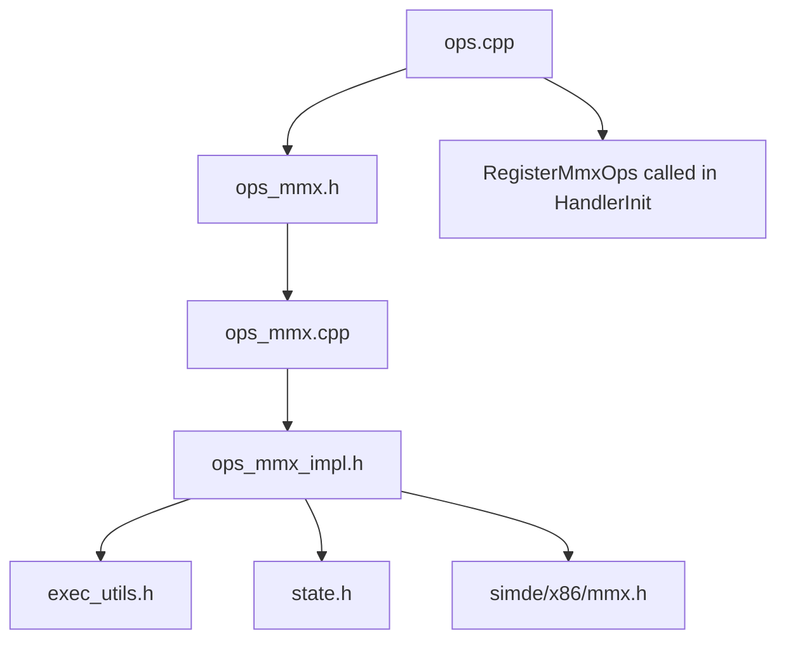

# MMX Instruction Set Implementation Plan

## Overview

This plan outlines the implementation of MMX instruction support for the x86emu project using SIMDe for cross-platform SIMD emulation.

## Background

### MMX Architecture
- MMX provides 8 64-bit registers (MM0-MM7)
- In real x86, MMX registers alias the low 64 bits of FPU registers (ST0-ST7)
- MMX instructions operate on packed integer data types (bytes, words, dwords)

### Current State
- The project already has SSE/SSE2 integer operations in `ops_sse_int.cpp`
- SSE2 integer ops use XMM registers (128-bit)
- The `Context` struct has `float80 fpu_regs[8]` for FPU state
- SIMDe provides MMX intrinsics via `<simde/x86/mmx.h>`

## Design Decisions

### MMX Register Storage
**Decision**: Use the `signif` field of `float80` directly for MMX storage.

The `float80` structure is:
```c
typedef struct {
    uint64_t signif;    // <-- MMX uses this 64-bit field
    uint16_t signExp;
} __attribute__((aligned(16))) float80;
```

This is cleaner because:
1. `signif` is exactly 64 bits - perfect for MMX data
2. Directly aliases the FPU register storage without casting the entire float80
3. Maintains x86 authenticity (MMX aliases FPU ST0-ST7)

```cpp
// Helper to get MMX register from FPU state
FORCE_INLINE uint64_t& GetMmxRegRaw(EmuState* state, int idx) {
    return state->ctx.fpu_regs[idx].signif;
}

// Helper to get MMX register as simde__m64 for SIMD operations
FORCE_INLINE simde__m64 GetMmxReg(EmuState* state, int idx) {
    uint64_t val = state->ctx.fpu_regs[idx].signif;
    return simde_mm_set_pi64x(static_cast<int64_t>(val));
}

// Helper to set MMX register
FORCE_INLINE void SetMmxReg(EmuState* state, int idx, simde__m64 val) {
    // Extract low 64 bits and store in signif
    simde__m64_private p = simde__m64_to_private(val);
    state->ctx.fpu_regs[idx].signif = p.i64[0];
}
```

### File Structure
Following the existing pattern:
- `libfibercpu/ops/ops_mmx.h` - Header with `RegisterMmxOps()` declaration
- `libfibercpu/ops/ops_mmx_impl.h` - Implementation with helpers and operations
- `libfibercpu/ops/ops_mmx.cpp` - Opcode handler registration

## MMX Instructions to Implement

### Opcode Map (0F prefix)

| Opcode | Instruction | Description |
|--------|-------------|-------------|
| 0F 60 | PUNPCKLBW | Unpack low bytes |
| 0F 61 | PUNPCKLWD | Unpack low words |
| 0F 62 | PUNPCKLDQ | Unpack low dwords |
| 0F 63 | PACKSSWB | Pack signed words to bytes |
| 0F 64 | PCMPGTB | Compare packed signed bytes for greater |
| 0F 65 | PCMPGTW | Compare packed signed words for greater |
| 0F 66 | PCMPGTD | Compare packed signed dwords for greater |
| 0F 67 | PACKUSWB | Pack unsigned words to bytes |
| 0F 68 | PUNPCKHBW | Unpack high bytes |
| 0F 69 | PUNPCKHWD | Unpack high words |
| 0F 6A | PUNPCKHDQ | Unpack high dwords |
| 0F 6B | PACKSSDW | Pack signed dwords to words |
| 0F 6E | MOVD | Move dword to MMX |
| 0F 6F | MOVQ | Move quadword to MMX |
| 0F 74 | PCMPEQB | Compare packed bytes for equality |
| 0F 75 | PCMPEQW | Compare packed words for equality |
| 0F 76 | PCMPEQD | Compare packed dwords for equality |
| 0F 77 | EMMS | Empty MMX state |
| 0F D1 | PSRLW | Shift right logical words |
| 0F D2 | PSRLD | Shift right logical dwords |
| 0F D3 | PSRLQ | Shift right logical quadword |
| 0F D5 | PMULLW | Multiply packed words |
| 0F D8 | PSUBUSB | Subtract packed unsigned bytes with saturation |
| 0F D9 | PSUBUSW | Subtract packed unsigned words with saturation |
| 0F DB | PAND | Bitwise AND |
| 0F DC | PADDUSB | Add packed unsigned bytes with saturation |
| 0F DD | PADDUSW | Add packed unsigned words with saturation |
| 0F DF | PANDN | Bitwise AND NOT |
| 0F E1 | PSRAW | Shift right arithmetic words |
| 0F E2 | PSRAD | Shift right arithmetic dwords |
| 0F E5 | PMULHW | Multiply packed words high |
| 0F E8 | PSUBSB | Subtract packed signed bytes with saturation |
| 0F E9 | PSUBSW | Subtract packed signed words with saturation |
| 0F EB | POR | Bitwise OR |
| 0F EC | PADDSB | Add packed signed bytes with saturation |
| 0F ED | PADDSW | Add packed signed words with saturation |
| 0F EF | PXOR | Bitwise XOR |
| 0F F1 | PSLLW | Shift left logical words |
| 0F F2 | PSLLD | Shift left logical dwords |
| 0F F3 | PSLLQ | Shift left logical quadword |
| 0F F5 | PMADDWD | Multiply and add packed words |
| 0F F8 | PSUBB | Subtract packed bytes |
| 0F F9 | PSUBW | Subtract packed words |
| 0F FA | PSUBD | Subtract packed dwords |
| 0F FB | PSUBQ | Subtract packed quadwords (SSE2 also) |
| 0F FC | PADDB | Add packed bytes |
| 0F FD | PADDW | Add packed words |
| 0F FE | PADDD | Add packed dwords |

### Group Opcodes (with ModRM)

| Opcode | Group | Description |
|--------|-------|-------------|
| 0F 71 | Group 12 | Shift immediate (PSLLW/PSRLW/PSRAW) |
| 0F 72 | Group 13 | Shift immediate (PSLLD/PSRLD/PSRAD) |
| 0F 73 | Group 14 | Shift immediate (PSLLQ/PSRLQ) |
| 0F C5 | PEXTRW | Extract word |
| 0F C6 | SHUFPS | Not MMX (SSE) |
| 0F D4 | PADDQ | Add packed quadwords |
| 0F E0 | PAVGB | Average packed bytes |
| 0F E3 | PAVGW | Average packed words |
| 0F E4 | PMULHUW | Multiply packed words high unsigned |
| 0F F6 | PSADBW | Sum of absolute differences |
| 0F 7E | MOVD | Move dword from MMX |
| 0F 7F | MOVQ | Move quadword from MMX |

## Implementation Details

### Helper Functions

```cpp
namespace fiberish {

// MMX register access - aliases FPU registers
FORCE_INLINE simde__m64& GetMmxReg(EmuState* state, int idx) {
    return *reinterpret_cast<simde__m64*>(&state->ctx.fpu_regs[idx]);
}

FORCE_INLINE void SetMmxReg(EmuState* state, int idx, simde__m64 val) {
    // Write to low 64 bits, preserve upper 16 bits (or zero them)
    std::memcpy(&state->ctx.fpu_regs[idx], &val, sizeof(simde__m64));
}

// Read MMX register or memory (64-bit)
template <OpOnTLBMiss Strategy>
FORCE_INLINE mem::MemResult<simde__m64> ReadMmxModRM(EmuState* state, ShimOp* op, mem::MicroTLB* utlb) {
    uint8_t mod = (op->modrm >> 6) & 3;
    uint8_t rm = op->modrm & 7;
    
    if (mod == 3) {
        return GetMmxReg(state, rm);
    } else {
        uint32_t addr = ComputeLinearAddress(state, op);
        if constexpr (Strategy == OpOnTLBMiss::Blocking) {
            return state->mmu.read<simde__m64, false>(addr, utlb, op);
        } else {
            auto value = state->mmu.read<simde__m64, true>(addr, utlb, op);
            if (!value) {
                value = state->request_read_and_check_pending<simde__m64>(addr, op->next_eip);
            }
            return value;
        }
    }
}

// Write MMX register or memory (64-bit)
template <OpOnTLBMiss Strategy>
FORCE_INLINE mem::MemResult<void> WriteMmxModRM(EmuState* state, ShimOp* op, simde__m64 val, mem::MicroTLB* utlb) {
    uint8_t mod = (op->modrm >> 6) & 3;
    uint8_t rm = op->modrm & 7;
    
    if (mod == 3) {
        SetMmxReg(state, rm, val);
        return {};
    } else {
        uint32_t addr = ComputeLinearAddress(state, op);
        if constexpr (Strategy == OpOnTLBMiss::Blocking) {
            return state->mmu.write<simde__m64, false>(addr, val, utlb, op);
        } else {
            auto result = state->mmu.write<simde__m64, true>(addr, val, utlb, op);
            if (!result) {
                result = state->request_write_and_check_pending<simde__m64>(addr, val, op->next_eip);
            }
            return result;
        }
    }
}

// EMMS - Empty MMX State
FORCE_INLINE LogicFlow OpEmms(LogicFuncParams) {
    // Reset FPU tag word to all empty (0xFFFF)
    state->ctx.fpu_tw = 0xFFFF;
    state->ctx.fpu_top = 0;
    return LogicFlow::Continue;
}

} // namespace fiberish
```

### Sample Operation Implementation

```cpp
// PADDB - Add Packed Bytes
FORCE_INLINE LogicFlow OpPaddb_Mmx(LogicFuncParams) {
    uint8_t reg = (op->modrm >> 3) & 7;
    
    auto src_res = ReadMmxModRM<OpOnTLBMiss::Restart>(state, op, utlb);
    if (!src_res) return LogicFlow::RestartMemoryOp;
    
    simde__m64 dst = GetMmxReg(state, reg);
    simde__m64 result = simde_mm_add_pi8(dst, *src_res);
    SetMmxReg(state, reg, result);
    
    return LogicFlow::Continue;
}
```

## Opcode Handler Registration

```cpp
// ops_mmx.cpp
#include "ops_mmx_impl.h"

namespace fiberish {
void RegisterMmxOps() {
    using namespace op;
    
    // Arithmetic
    g_Handlers[0x0FC] = DispatchWrapper<OpPaddb_Mmx>;  // PADDB
    g_Handlers[0x0FD] = DispatchWrapper<OpPaddw_Mmx>;  // PADDW
    g_Handlers[0x0FE] = DispatchWrapper<OpPaddd_Mmx>;  // PADDD
    g_Handlers[0x0FB] = DispatchWrapper<OpPsubb_Mmx>;  // PSUBB
    // ... more registrations
    
    // Logical
    g_Handlers[0x0DB] = DispatchWrapper<OpPand_Mmx>;   // PAND
    g_Handlers[0x0DF] = DispatchWrapper<OpPandn_Mmx>;  // PANDN
    g_Handlers[0x0EB] = DispatchWrapper<OpPor_Mmx>;    // POR
    g_Handlers[0x0EF] = DispatchWrapper<OpPxor_Mmx>;   // PXOR
    
    // Compare
    g_Handlers[0x074] = DispatchWrapper<OpPcmpeqb_Mmx>; // PCMPEQB
    g_Handlers[0x075] = DispatchWrapper<OpPcmpeqw_Mmx>; // PCMPEQW
    g_Handlers[0x076] = DispatchWrapper<OpPcmpeqd_Mmx>; // PCMPEQD
    
    // EMMS
    g_Handlers[0x077] = DispatchWrapper<OpEmms>;        // EMMS
    
    // Data movement
    g_Handlers[0x06E] = DispatchWrapper<OpMovd_Mmx>;    // MOVD to MMX
    g_Handlers[0x06F] = DispatchWrapper<OpMovq_Mmx>;    // MOVQ to MMX
    g_Handlers[0x07E] = DispatchWrapper<OpMovd_Mmx>;    // MOVD from MMX
    g_Handlers[0x07F] = DispatchWrapper<OpMovq_Mmx>;    // MOVQ from MMX
    
    // ... more registrations
}
} // namespace fiberish
```

## Files to Create/Modify

### New Files
1. `libfibercpu/ops/ops_mmx.h`
2. `libfibercpu/ops/ops_mmx_impl.h`
3. `libfibercpu/ops/ops_mmx.cpp`

### Modified Files
1. `libfibercpu/ops.cpp` - Add `RegisterMmxOps()` call

## Opcode Index Mapping

For the handler array `g_Handlers[1024]`:
- Map 0 (no prefix): `index = opcode`
- Map 1 (0F prefix): `index = 0x100 | opcode`

So MMX opcodes (all 0F prefixed) use:
- `0x1FC` for 0F FC (PADDB)
- `0x1FD` for 0F FD (PADDW)
- etc.

## Notes on SSE vs MMX Overlap

Some SSE2 integer instructions share the same opcode encoding as MMX but:
- MMX: No prefix, operates on MM0-MM7 (64-bit)
- SSE2: 66h prefix, operates on XMM0-XMM7 (128-bit)

The existing `ops_sse_int.cpp` handles SSE2 variants with 66h prefix.
The new `ops_mmx.cpp` will handle MMX variants without prefix.

## Testing Considerations

1. Test MMX register aliasing with FPU state
2. Test EMMS properly resets FPU tag word
3. Test memory operations for MMX load/store
4. Verify saturation arithmetic for PADDS/PSUBS variants
5. Test shift operations with various count values

## Mermaid Diagram: File Dependencies



## Implementation Order

1. Create header file `ops_mmx.h`
2. Create implementation header `ops_mmx_impl.h` with:
   - MMX register access helpers
   - EMMS instruction
   - Basic arithmetic (PADDB, PADDW, PADDD, PSUBB, PSUBW, PSUBD)
   - Logical operations (PAND, PANDN, POR, PXOR)
   - Data movement (MOVD, MOVQ)
3. Create registration file `ops_mmx.cpp`
4. Update `ops.cpp` to call `RegisterMmxOps()`
5. Add remaining MMX instructions incrementally
